# AutoRent

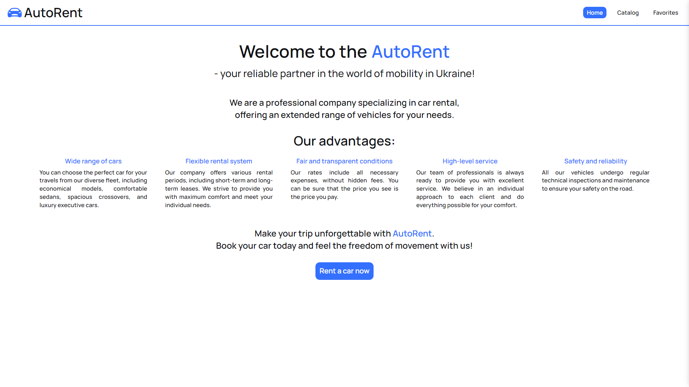

## Features

This app serves as a car rental catalog. Here, users can browse cars available for rent, filter them, add them to their favorites, and, of course, rent a car.

### Catalog

This is the catalog page, where the user sees the cars available for rent and information about them.

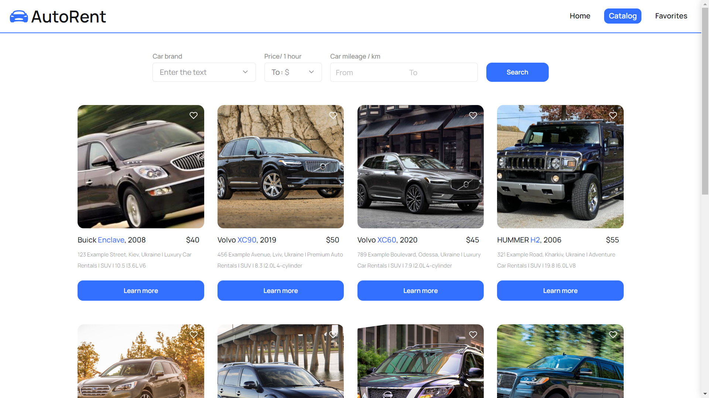

There are three types of filters for a more accurate search for the right car.

#### Filter by car brand

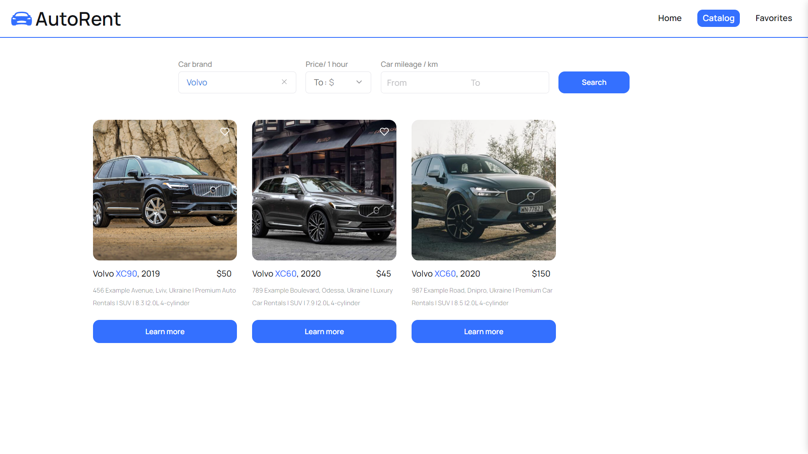

#### Filter by price (up to the selected amount)

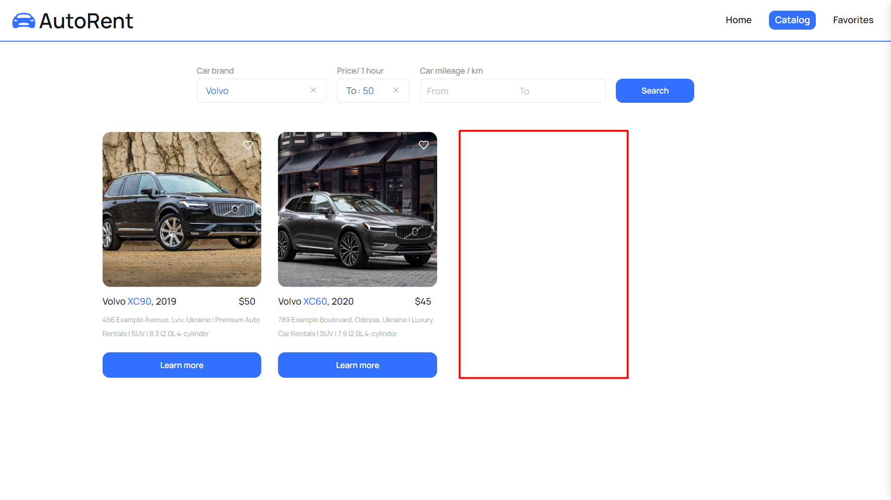

#### Filter by mileage (from -km to -km)

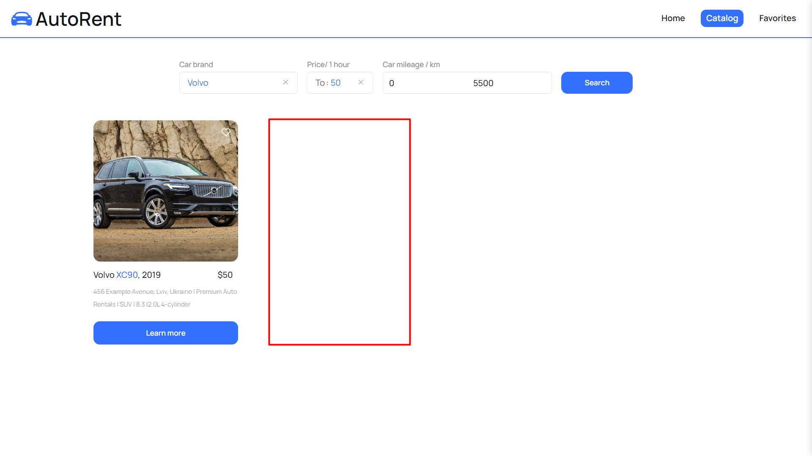

#### Learn more

If there is not enough information about the car displayed in the catalog, you can learn more about it by clicking the "Learn more" button.

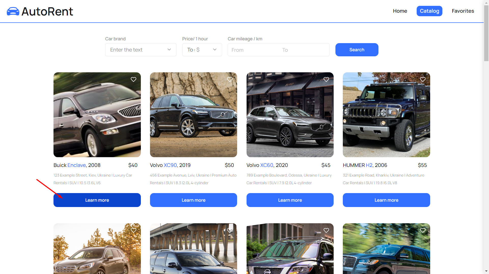

This will open a modal window with more information about the car.

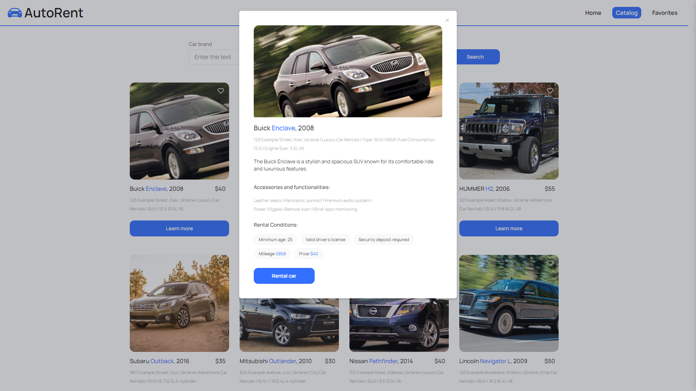

And at the bottom of the window, there is a "Rental car" button that allows the user to immediately contact the renter.

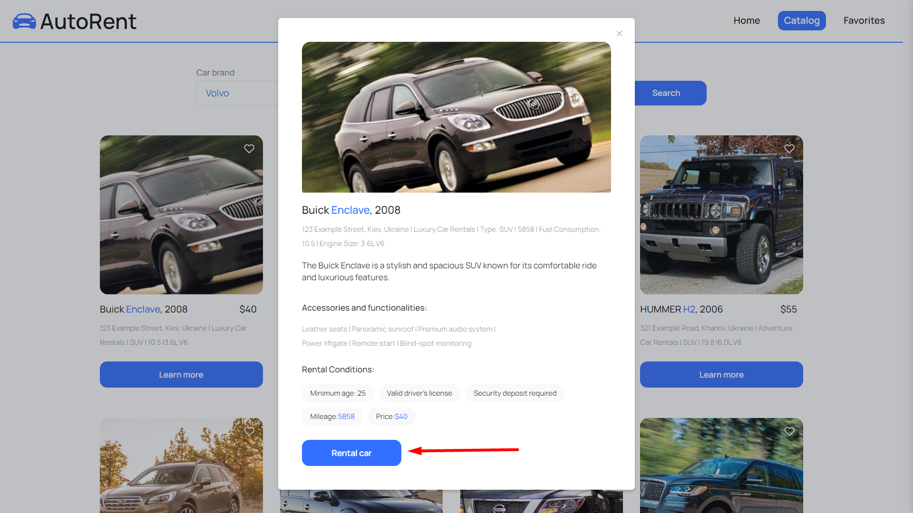

#### Load more

Not enough cars in the catalog? No problem! Just click the "Load more" button and you will see 12 more cars.

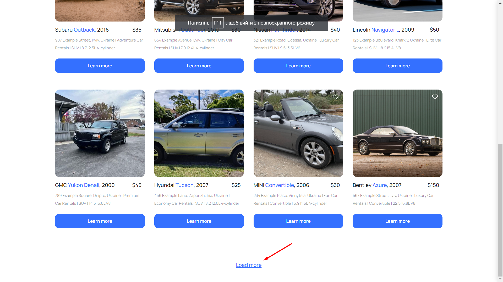
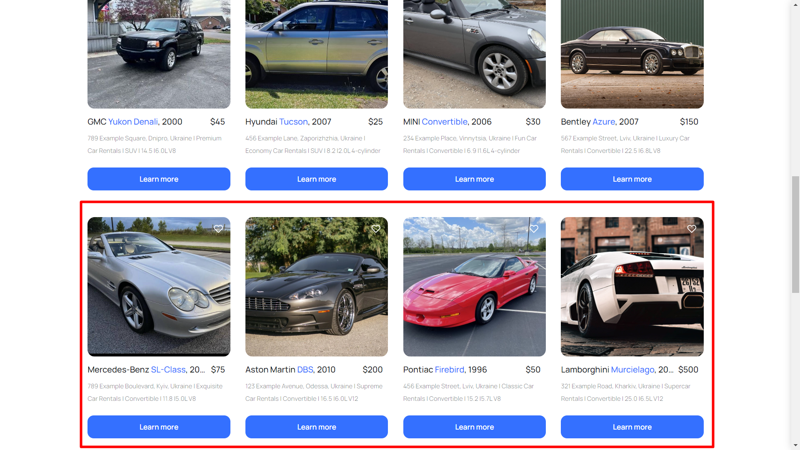

#### Add to favorites

If you like a car, you can save it to your favorites so that you don't lose it among others.

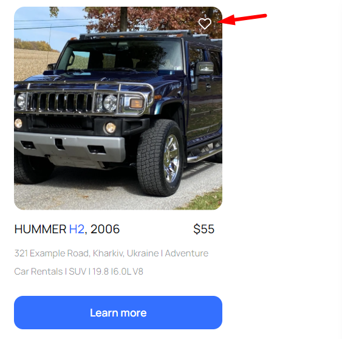
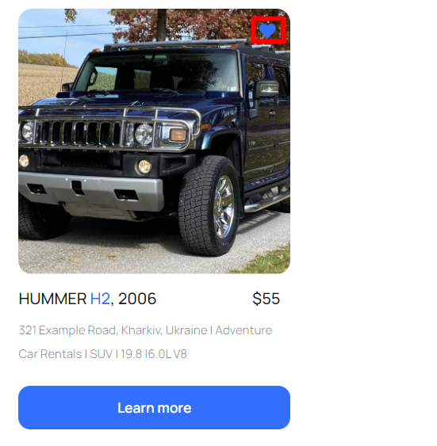

### Favorites

This is a list of cars selected from the catalog. Here, you can also view information about each of them and rent one.

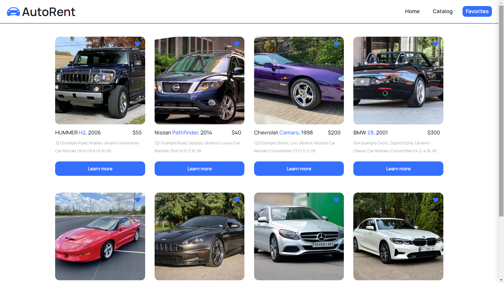
